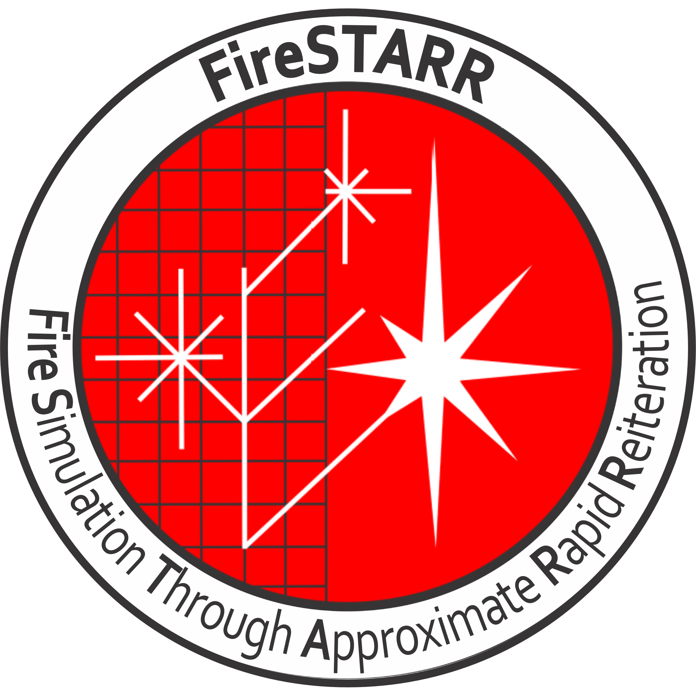
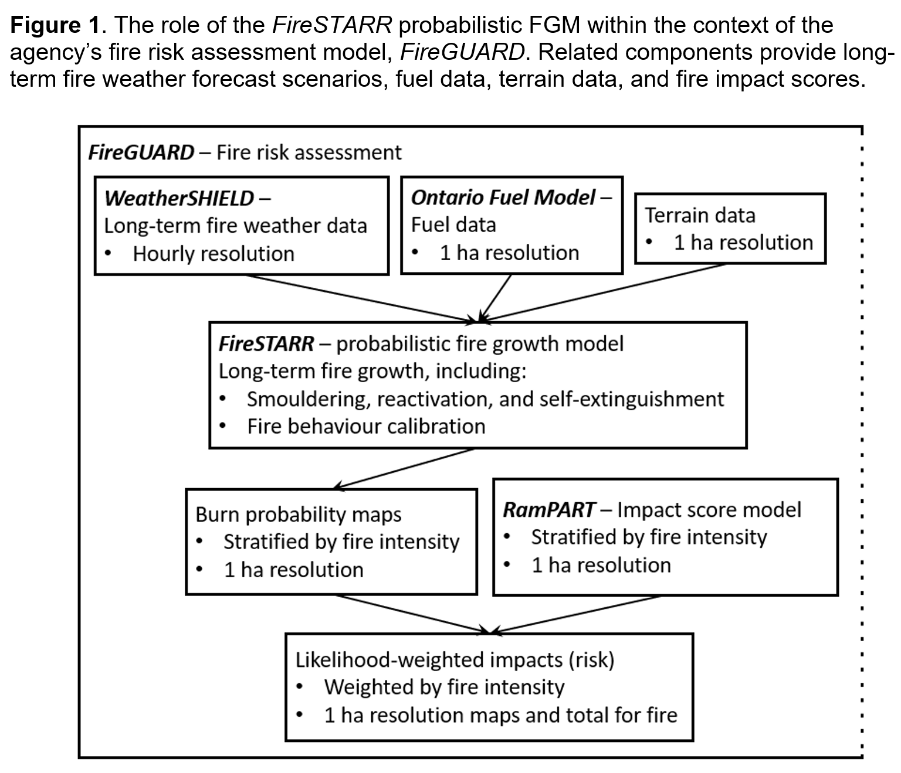

# About FireSTARR

## Overview

FireSTARR is designed to support wildland fire response decision-making, and is the fire growth algorithm originally in the FireGUARD suite of programs.

It focuses on the generation of burn probabilities from replicated simulation of fire growth, smouldering, and natural extinction under the weather and stochastic fire behaviour scenarios.

## Additional License Condition

All covered works (e.g., copies of this work, derived works) must include a copy of the file (or an updated version of it) that details credits for work up to the time of the original open source release. That file is available [here](./ORIGIN.md).

## Publications

| Model         | Title                                                                                                                                                                            |
|---------------|----------------------------------------------------------------------------------------------------------------------------------------------------------------------------------|
| FireGUARD     | [History and overview of research and development for Ontario’s FireGUARD decision support system for appropriate response](https://pubs.cif-ifc.org/doi/10.5558/tfc2025-015)    |
| WeatherSHIELD | [Assembling and Customizing Multiple Fire Weather Forecasts for Burn Probability and Other Fire Management Applications in Ontario, Canada](https://doi.org/10.3390/fire3020016) |
| RamPART       | [Impacts of wildland fire effects on resources and assets through expert elicitation to support fire response decisions](https://doi.org/10.1071/WF18189)                        |
| FireSTARR     | FireSTARR: a fast probabilistic forest fire growth model using approximate wavelet geometry (in progress)                                                                        |
